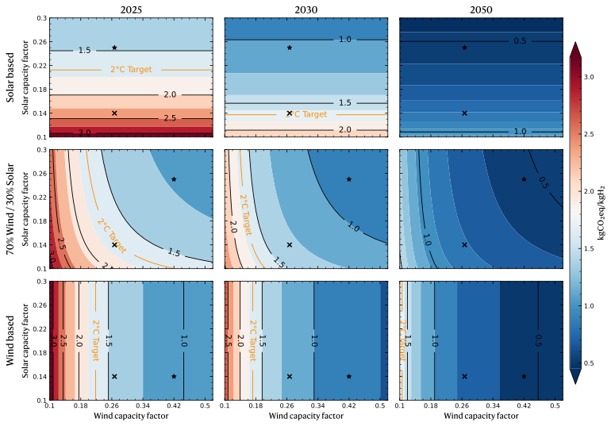

# **Prospective Global Warming Potential of Australian Low-Emission Hydrogen in a Net-Zero Emission Context**

Michaël Lejeunea,b,*, Sami Karaa,b, Michael Zwicky Hauschildc,d, Rahman Daiyanb,e   

aSustainability in Manufacturing and Life Cycle Engineering Research Group, school of Mechanical and Manufacturing Engineering, the University of New South Wales, 2052, Sydney, Australia 

bAustralian Research Council Training Centre for the Global Hydrogen Economy (GlobH2e), the University of New South Wales, 2052, Sydney, Australia  

cCentre for Absolute Sustainability, Technical University of Denmark, Kgs, Lyngby, Denmark

dDivision for Quantitative Sustainability Assessment (QSA), Department of Environmental and Resource Engineering, Technical University of Denmark, Kgs, Lyngby, Denmark 

eSchool of Minerals and Energy Engineering, The University of New South Wales, Sydney 2052, Australia 

---

This repository contains some generated functions to replicate Lejeune, M. et al. (2025) ‘Prospective Global Warming Potential of Australian Low-Emission Hydrogen in a Net-Zero Emission Context’, Procedia CIRP, 135, pp. 636–641. Available at: https://doi.org/10.1016/j.procir.2025.01.066.

